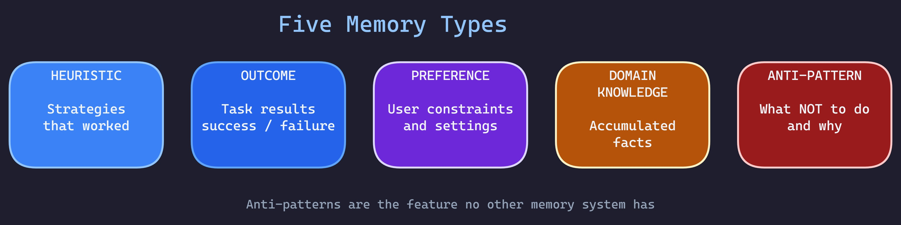
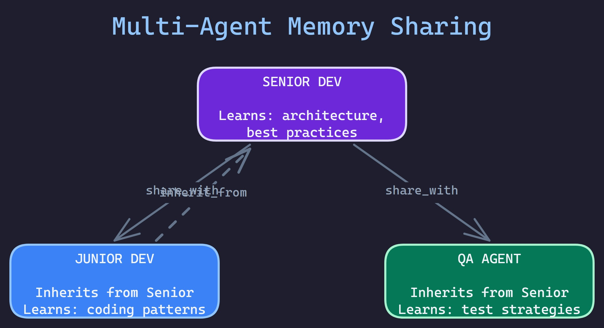

# ALMA - Agent Learning Memory Architecture

[](https://pypi.org/project/alma-memory/)
[](https://www.npmjs.com/package/@rbkunnela/alma-memory)
[](https://www.python.org/downloads/)
[](https://opensource.org/licenses/MIT)
[](https://github.com/RBKunnela/ALMA-memory/actions/workflows/ci.yml)
[](https://alma-memory.pages.dev)
[](https://buymeacoffee.com/aiagentsprp)

<div align="center">

### Your AI forgets everything. ALMA fixes that.

**One memory layer. Every AI. Never start from zero.**

`pip install alma-memory` — 5 minutes to persistent memory. Free forever on SQLite.

[**Documentation**](https://alma-memory.pages.dev) | [**Setup Guide**](GUIDE.md) | [**PyPI**](https://pypi.org/project/alma-memory/) | [**npm**](https://www.npmjs.com/package/@rbkunnela/alma-memory)

</div>

---

## What Is ALMA?

ALMA is a **Python library** that gives AI agents **permanent, searchable, compounding memory**.

Every time you start a new Claude session, a new ChatGPT conversation, or spin up any AI agent — it starts from zero. Your context, your preferences, the solutions it already found, the mistakes it already made — gone. You repeat yourself hundreds of times a year.

ALMA sits between your AI and a database you control. Before every task, it retrieves what the agent learned from past runs. After every task, it stores the outcome. Over time, the system builds a growing knowledge base that makes every future conversation smarter than the last.


**It's not a service. It's a library.** You install it, connect it to your own database (even a local SQLite file), and your AI agents start remembering.

---

## Why Not Just Use Claude's Memory or ChatGPT Memory?

Claude Projects, ChatGPT Memory, and Gemini's context all have built-in memory. Here's what they can't do:

| What You Need | Built-in AI Memory | ALMA |
|---|---|---|
| **Memory across different AIs** | Locked to one platform. Claude doesn't know what you told ChatGPT. | One memory layer shared across every AI tool you use. |
| **Memory that learns from outcomes** | Stores conversations, not lessons. Doesn't know what worked vs. failed. | Tracks success/failure per strategy. Recommends what actually works. |
| **Anti-pattern tracking** | No concept of "what NOT to do." | Explicit anti-patterns with `why_bad` + `better_alternative`. |
| **Scoped learning** | All-or-nothing context window. | Agents only learn within defined domains (`can_learn` / `cannot_learn`). |
| **Multi-agent knowledge sharing** | Each assistant is isolated. | Agents inherit knowledge from senior agents. Teams share across roles. |
| **Your data, your infrastructure** | Stored on their servers. You can't export it. | Your database, your rules. SQLite, PostgreSQL, Qdrant, Pinecone — you choose. |
| **Scoring beyond similarity** | "Most recent" or basic relevance. | 4-factor scoring: similarity + recency + success rate + confidence. |
| **Memory lifecycle** | Grows until you manually prune. | Automatic decay, compression, consolidation, and archival. |
| **Workflow context** | Stateless between sessions. | Checkpoints, state merging, and scoped retrieval across workflow runs. |

**The fundamental difference:** Built-in AI memory stores *conversations*. ALMA stores *intelligence* — what worked, what failed, what to avoid, and why.

Week 1, basic retrieval works. Week 4, patterns emerge across sessions. Week 12, cross-domain connections surface automatically. Week 52, the system knows your work better than any single conversation ever could.

---

## What ALMA Can Do

| Capability | Description |
|---|---|
| **5 Memory Types** | Heuristics (strategies), outcomes (results), preferences (user constraints), domain knowledge (facts), anti-patterns (what not to do) |
| **7 Storage Backends** | SQLite+FAISS, PostgreSQL+pgvector, Qdrant, Pinecone, Chroma, Azure Cosmos DB, File |
| **4 Graph Backends** | Neo4j, Memgraph, Kuzu, In-memory — entity relationship tracking |
| **22 MCP Tools** | Native Claude Code / Claude Desktop integration via stdio or HTTP |
| **RAG Bridge** | Enhance any RAG system (LangChain, LlamaIndex) with memory signals and feedback loops |
| **Multi-Factor Scoring** | Similarity + recency + success rate + confidence — not just vector distance |
| **Multi-Agent Sharing** | Hierarchical knowledge sharing with `inherit_from` + `share_with` |
| **Memory Lifecycle** | Decay, compression, consolidation, archival, verified retrieval |
| **Workflow Context** | Checkpoints, state merging, artifacts, scoped retrieval |
| **Event System** | Webhooks + in-process callbacks for real-time memory reactions |
| **Domain Factory** | 6 pre-built schemas: coding, research, sales, support, content, general |
| **TypeScript SDK** | Full-featured JavaScript/TypeScript client library |
| **Scoped Learning** | Agents only learn within defined domains — prevents knowledge contamination |

---

## Installation

```bash
pip install alma-memory
```

ALMA needs a database to store memories. **Follow the [Setup Guide (GUIDE.md)](GUIDE.md) for complete database setup instructions** — covers every backend, written for all experience levels.

The simplest option uses SQLite — it runs locally on your machine with zero setup:

```bash
pip install alma-memory[local]     # SQLite + FAISS + local embeddings — nothing else to install
```

For production or cloud-hosted memory:

```bash
pip install alma-memory[postgres]  # PostgreSQL + pgvector
pip install alma-memory[qdrant]    # Qdrant vector database
pip install alma-memory[pinecone]  # Pinecone vector database
pip install alma-memory[chroma]    # ChromaDB
pip install alma-memory[azure]     # Azure Cosmos DB
pip install alma-memory[rag]       # RAG integration (hybrid search, reranking)
pip install alma-memory[all]       # Everything
```

**TypeScript/JavaScript:**
```bash
npm install @rbkunnela/alma-memory
```

> **Need help setting up a database?** See [**GUIDE.md**](GUIDE.md) for step-by-step instructions — from local SQLite (zero infrastructure) to cloud PostgreSQL (free tier available). Written for all experience levels.

---

## Quick Start

### 1. Create a config file

```yaml
# .alma/config.yaml
alma:
  project_id: "my-project"
  storage: sqlite
  embedding_provider: local
  storage_dir: .alma
  db_name: alma.db
  embedding_dim: 384
```

### 2. Use ALMA in your code

```python
from alma import ALMA

# Initialize from config
alma = ALMA.from_config(".alma/config.yaml")

# Before task: Get relevant memories
memories = alma.retrieve(
    task="Test the login form validation",
    agent="qa_tester",
    top_k=5
)

# Inject into your AI prompt
prompt = f"""
## Your Task
Test the login form validation

## Knowledge from Past Runs
{memories.to_prompt()}
"""

# After task: Learn from the outcome
alma.learn(
    agent="qa_tester",
    task="Test login form",
    outcome="success",
    strategy_used="Tested empty fields, invalid email, valid submission",
)

# Next time: the QA tester remembers what worked
```

### 3. That's it

Every time your QA agent runs, it retrieves what worked before and learns from new outcomes. No manual prompt engineering. No copy-pasting from past conversations. The memory compounds automatically.

---

## Five Memory Types

ALMA doesn't just store text. It categorizes knowledge into five types that serve different purposes:



| Type | What It Stores | Example |
|---|---|---|
| **Heuristic** | Strategies that worked | "For forms with >5 fields, test validation incrementally" |
| **Outcome** | Task results (success/failure) | "Login test succeeded using JWT token strategy — 340ms" |
| **Preference** | User constraints | "User prefers verbose test output, dark theme, Python 3.12" |
| **Domain Knowledge** | Accumulated facts | "Login uses OAuth 2.0 with 24h token expiry" |
| **Anti-Pattern** | What NOT to do | "Don't use sleep() for async waits — causes flaky tests. Use explicit waits instead." |

Anti-patterns are the feature no other memory system has. When your AI makes a mistake, ALMA records *what went wrong, why it's bad, and what to do instead*. Next time, it knows to avoid that path before it starts.

---

## Multi-Agent Memory Sharing

Agents don't have to learn everything from scratch. Junior agents can inherit knowledge from senior agents:



```yaml
agents:
  senior_dev:
    can_learn: [architecture, best_practices]
    share_with: [junior_dev, qa_agent]

  junior_dev:
    can_learn: [coding_patterns]
    inherit_from: [senior_dev]
```

```python
# Junior dev retrieves memories — including senior's shared knowledge
memories = alma.retrieve(
    task="Implement user authentication",
    agent="junior_dev",
    include_shared=True
)
```

---

## Storage Backends

ALMA is a library, not a service. You choose where your data lives:

| Backend | Best For | Vector Search | Production Ready |
|---|---|---|---|
| **SQLite + FAISS** | Local development, offline | Yes | Yes |
| **PostgreSQL + pgvector** | Production, high availability | Yes (HNSW) | Yes |
| **Qdrant** | Managed vector DB | Yes (HNSW) | Yes |
| **Pinecone** | Serverless vector DB | Yes | Yes |
| **Chroma** | Lightweight local | Yes | Yes |
| **Azure Cosmos DB** | Enterprise, Azure-native | Yes (DiskANN) | Yes |
| **File-based** | Testing, CI/CD | No | No |

| Platform | Backend | Starting Cost |
|---|---|---|
| **Your Laptop** | SQLite+FAISS | $0.00 |
| **Supabase** | PostgreSQL+pgvector | $0.00 (free tier) |
| **AWS / GCP / Azure** | PostgreSQL, Qdrant, Pinecone, Cosmos DB | Varies |
| **Self-hosted** | PostgreSQL+pgvector | $5-10/mo |

> **Step-by-step database setup for every backend:** See [**GUIDE.md**](GUIDE.md)

---

## MCP Server Integration

Connect ALMA directly to Claude Code or Claude Desktop with 22 MCP tools:

```bash
python -m alma.mcp --config .alma/config.yaml
```

```json
// .mcp.json (for Claude Code)
{
  "mcpServers": {
    "alma-memory": {
      "command": "python",
      "args": ["-m", "alma.mcp", "--config", ".alma/config.yaml"]
    }
  }
}
```

**22 MCP Tools** — retrieve memories, learn from outcomes, manage preferences, checkpoint workflows, consolidate memories, verified retrieval, compression, and more. Every ALMA feature accessible from Claude's tool system.

---

## RAG Integration

Enhance any RAG framework with ALMA memory signals:

```python
from alma import ALMA, RAGBridge, RAGChunk

alma = ALMA.from_config(".alma/config.yaml")
bridge = RAGBridge(alma=alma)

# Your RAG system retrieves chunks (LangChain, LlamaIndex, etc.)
chunks = [
    RAGChunk(id="1", text="Deploy with blue-green strategy", score=0.85),
    RAGChunk(id="2", text="Use rolling updates for zero downtime", score=0.78),
]

# ALMA enhances with memory signals — past success/failure data
result = bridge.enhance(
    chunks=chunks,
    query="how to deploy auth service safely",
    agent="backend-agent",
)
```

Includes hybrid search (vector + keyword with RRF fusion), feedback loops for auto-tuning retrieval weights, and IR metrics (MRR, NDCG, Recall, MAP).

---

## Graph Memory

Track entity relationships alongside vector memory:

```python
from alma.graph import create_graph_backend, BackendGraphStore, EntityExtractor

backend = create_graph_backend("neo4j", uri="neo4j+s://...", username="neo4j", password="...")
graph = BackendGraphStore(backend)
extractor = EntityExtractor()

entities, relationships = extractor.extract(
    "Alice from Acme Corp reviewed the PR that Bob submitted."
)

for entity in entities:
    graph.add_entity(entity)
for rel in relationships:
    graph.add_relationship(rel)
```

Four backends: Neo4j (production), Memgraph (streaming), Kuzu (embedded), In-memory (testing).

---

## Event System

React to memory changes in real-time:

```python
from alma.events import get_emitter, MemoryEventType

def on_memory_created(event):
    print(f"Memory created: {event.memory_id} by {event.agent}")

emitter = get_emitter()
emitter.subscribe(MemoryEventType.CREATED, on_memory_created)
```

Supports webhooks with retry logic, HMAC signature verification, and 5 event types: `CREATED`, `UPDATED`, `DELETED`, `ACCESSED`, `CONSOLIDATED`.

---

## Architecture


---

## Configuration

```yaml
# .alma/config.yaml
alma:
  project_id: "my-project"
  storage: sqlite  # sqlite | postgres | qdrant | pinecone | chroma | azure | file
  embedding_provider: local  # local | azure | mock
  storage_dir: .alma
  db_name: alma.db
  embedding_dim: 384

  agents:
    qa_tester:
      domain: coding
      can_learn:
        - testing_strategies
        - selector_patterns
      cannot_learn:
        - backend_logic
      min_occurrences_for_heuristic: 3
      share_with: [qa_lead]

    backend_dev:
      domain: coding
      can_learn:
        - api_patterns
        - database_queries
      inherit_from: [senior_architect]
```

For full backend configuration (PostgreSQL, Qdrant, Pinecone, Chroma, Azure, embedding providers): See [**GUIDE.md**](GUIDE.md)

---

## Comparisons

<details>
<summary>ALMA vs Mem0, LangChain Memory, and Graphiti</summary>

| Feature | ALMA | Mem0 | LangChain | Graphiti |
|---|---|---|---|---|
| **Memory Scoping** | `can_learn` / `cannot_learn` per agent | Basic isolation | Session-based | None |
| **Anti-Pattern Learning** | `why_bad` + `better_alternative` | None | None | None |
| **Multi-Agent Sharing** | `inherit_from` + `share_with` | None | None | None |
| **Multi-Factor Scoring** | 4 factors (similarity + recency + success + confidence) | Similarity only | Similarity only | Similarity only |
| **MCP Integration** | 22 tools | None | None | None |
| **Workflow Checkpoints** | Full checkpoint/resume/merge | None | None | None |
| **TypeScript SDK** | Full-featured client | None | JavaScript wrappers | None |
| **Graph + Vector Hybrid** | 4 graph + 7 vector backends | Limited | Limited | Graph-focused |
| **Memory Consolidation** | LLM-powered deduplication | Basic | None | None |
| **Event System** | Webhooks + in-process callbacks | None | None | None |
| **Domain Factory** | 6 pre-built schemas | None | None | None |

**The key difference:** Most solutions treat memory as "store embeddings, retrieve similar." ALMA treats it as "teach agents to improve within safe boundaries."

</details>

---

## Release History

<details>
<summary>v0.8.0 - RAG Integration Layer</summary>

- RAG Bridge: Accept chunks from any RAG framework and enhance with memory signals
- Hybrid Search: Vector + keyword with RRF fusion
- Feedback Loop: Track and auto-tune retrieval weights
- IR Metrics: MRR, NDCG, Recall, Precision, MAP
- Cross-Encoder Reranking: Pluggable reranking pipeline

</details>

<details>
<summary>v0.7.x - Memory Wall + Intelligence Layer</summary>

- Memory Decay: Time-based confidence decay
- Memory Compression: LLM + rule-based summarization
- Verified Retrieval: Two-stage verification pipeline
- Retrieval Modes: 7 cognitive task modes
- Trust-Integrated Scoring, Token Budget, Progressive Disclosure
- 6 new MCP tools for Memory Wall
- Archive System: Soft-delete with recovery
- Embedding Performance Boost: 2.6x faster via batched processing + LRU cache
- Storage Backend Factory, Consolidation Strategies, Standalone Dedup Engine

</details>

<details>
<summary>v0.6.0 - Workflow Context Layer</summary>

- Checkpoint & Resume workflow state
- State Reducers for parallel agent states
- Artifact Linking to workflows
- Scoped Retrieval by workflow/agent/project
- 8 MCP Workflow Tools
- TypeScript SDK v0.6.0 with full workflow API parity

</details>

<details>
<summary>v0.5.0 - Vector Database Backends</summary>

- Qdrant, Pinecone, Chroma backends
- Graph Database Abstraction (Neo4j, Memgraph, Kuzu, In-memory)
- Testing Module (MockStorage, MockEmbedder, factories)
- Memory Consolidation Engine
- Event System (Webhooks + callbacks)
- TypeScript SDK initial release
- Multi-Agent Memory Sharing

</details>

See [CHANGELOG.md](CHANGELOG.md) for the complete history.

---

## Architectural Decision Records

ALMA documents every major design decision with the reasoning behind it. If you're extending ALMA, contributing, or building on top of it, these records explain *why* things work the way they do — not just *what* the code does.

| Decision | What It Covers | Why It Matters to You |
|---|---|---|
| [**AIDR-001**](docs/architecture/aidr/AIDR-001-storage-backend-abstraction.md) | Storage backend abstraction (ABC pattern) | Understand why all 7 backends share one interface, and how to add your own |
| [**AIDR-002**](docs/architecture/aidr/AIDR-002-memory-type-taxonomy.md) | 5 memory types and their lifecycles | Know when to use heuristics vs. anti-patterns, and how to extend the taxonomy |
| [**AIDR-003**](docs/architecture/aidr/AIDR-003-cross-agent-scope-model.md) | Cross-agent scope model | Understand `can_learn` / `share_with` / `inherit_from` boundaries |
| [**AIDR-004**](docs/architecture/aidr/AIDR-004-mcp-tool-architecture.md) | MCP tool categories (22 tools, 5 modules) | Know where to add new tools and why they're organized this way |
| [**AIDR-005**](docs/architecture/aidr/AIDR-005-trust-scoring-integration.md) | Trust-weighted scoring in retrieval | Understand how agent trust levels affect which memories surface |

These records are reviewed quarterly and updated whenever the covered area changes significantly.

---

## Quality Framework

ALMA uses semantic validation to catch a specific class of bugs that normal testing misses: **tests that pass while memory correctness is broken.**

For a memory library, this is critical. A test that asserts "storage was called" but doesn't verify "the correct data was stored and can be retrieved" gives false confidence. ALMA's development workflow includes adversarial review questions that challenge every new test:

- Does this test verify the **stored value** is correct, or just that storage was called?
- Could this test pass while retrieved memory is actually wrong or corrupted?
- Are scope boundaries (`can_learn`, `share_with`) actually enforced at runtime, or just documented?

This framework is documented in `.claude/rules/svg-enforcement.md` and runs as an advisory layer during code review. It's not a replacement for testing — it's a check that tests are testing the right things.

**Current test suite:** 1,682 passing tests across 87 files (unit, integration, e2e, performance).

---

## Roadmap

**v0.9.0 — Personal Brain:**
- Thought capture pipeline (natural language to classify to store to confirm)
- Personal Brain domain schema (7th pre-built schema)
- `alma init --open-brain` interactive CLI setup
- Memory migration from Claude, ChatGPT, Obsidian, Notion
- Multi-client MCP protocol (concurrent access from any AI tool)

**v1.0.0 — Open Brain:**
- Weekly review synthesis (pattern detection, connection finding)
- Confidence-based routing with fix flow
- Operating modes (always-on / scheduled / session-based)
- Full documentation site with 45-minute tutorial
- Temporal reasoning (time-aware retrieval)

---

## Troubleshooting

See [**GUIDE.md**](GUIDE.md) for detailed troubleshooting. Quick fixes for common issues:

<details>
<summary>Common Issues</summary>

**ImportError: sentence-transformers is required**
```bash
pip install alma-memory[local]
```

**pgvector extension not found**
```sql
CREATE EXTENSION IF NOT EXISTS vector;
```

**Embeddings dimension mismatch**
- Ensure `embedding_dim` in config matches your embedding provider
- Local: 384, Azure text-embedding-3-small: 1536

**Debug Logging:**
```python
import logging
logging.getLogger("alma").setLevel(logging.DEBUG)
```

</details>

---

## Contributing

We welcome contributions! See [CONTRIBUTING.md](CONTRIBUTING.md) for guidelines.

For questions, support, or contribution guidelines, email **dev@friendlyai.fi**.

**What we need most:**
- Documentation improvements
- Test coverage for edge cases
- Additional LLM provider integrations (Ollama, Groq)
- Frontend dashboard for memory visualization

---

## License

MIT

---

## Support the Project

If ALMA helps your AI agents get smarter:

- **Star this repo** - Helps others discover ALMA
- **[Buy me a coffee](https://buymeacoffee.com/aiagentsprp)** - Support continued development
- **[Sponsor on GitHub](https://github.com/sponsors/RBKunnela)** - Become an official sponsor
- **Contribute** - PRs welcome! See [CONTRIBUTING.md](CONTRIBUTING.md)
- **Get help** - Email **dev@friendlyai.fi** for support and inquiries

---

| Metric | Value |
|---|---|
| Tests passing | 1,682 |
| Tests failing | 0 |
| Storage backends | 7 |
| Graph backends | 4 |
| MCP tools | 22 |
| Source files | 107 |
| Monthly cost (local) | $0.00 |
| Monthly cost (Supabase) | $0.00 (free tier) |
| Time to first memory | < 5 minutes |
| Vendor lock-in | None |

---

**Your AI should not treat you like a stranger every morning. ALMA makes sure it never does again.**

**Every conversation makes the next one better.**

*Created by [@RBKunnela](https://github.com/RBKunnela)*
