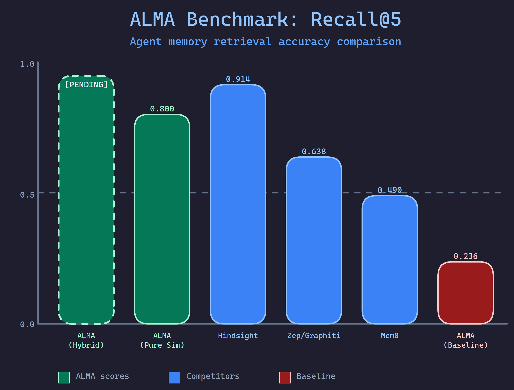
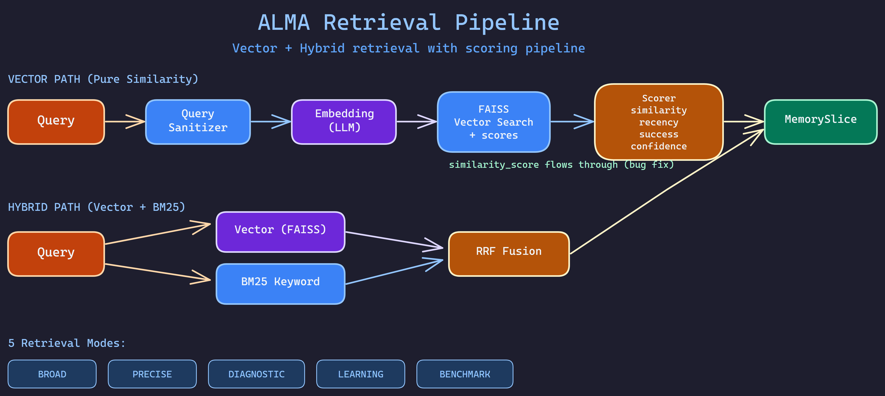
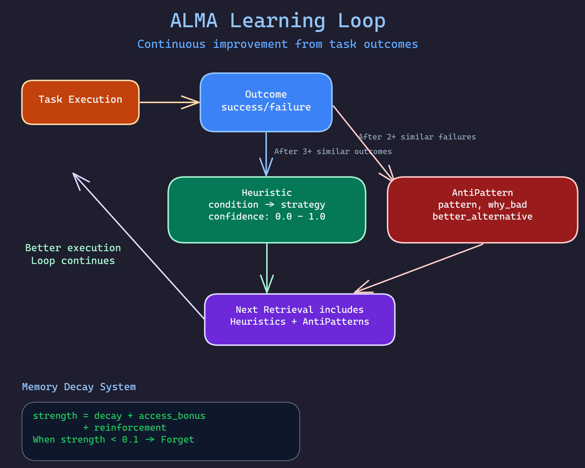
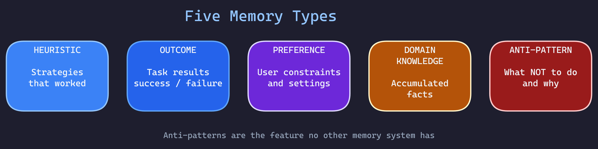
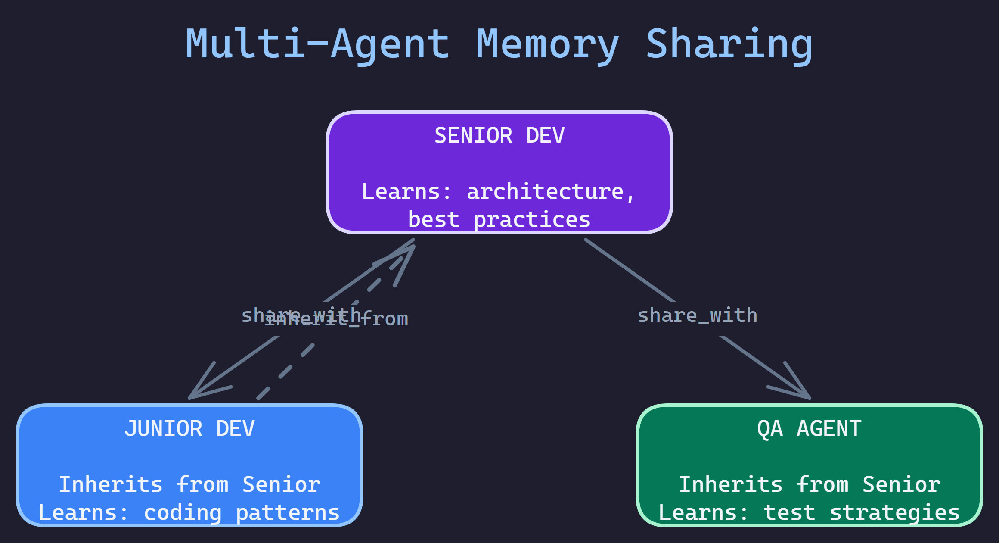
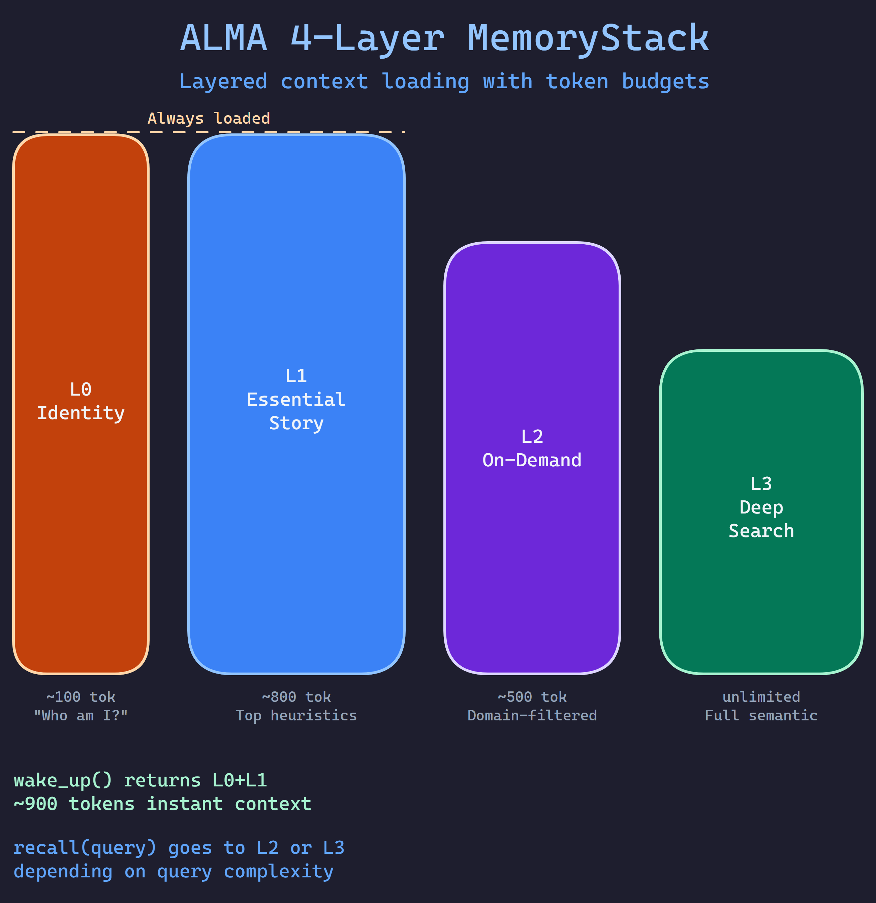

# ALMA - Agent Learning Memory Architecture

[](https://pypi.org/project/alma-memory/)
[](https://www.python.org/downloads/)
[](https://opensource.org/licenses/MIT)
[](https://github.com/RBKunnela/ALMA-memory/actions/workflows/ci.yml)
[](docs/benchmarks/BENCHMARK-REPORT.md)
[](https://buymeacoffee.com/aiagentsprp)

<div align="center">

### Your AI forgets everything. ALMA fixes that.

**Give any AI agent permanent memory that learns and improves over time.**

`pip install alma-memory` — 5 minutes to persistent memory. Free forever on SQLite.

[**Documentation**](https://alma-memory.pages.dev) | [**Benchmark Report**](docs/benchmarks/BENCHMARK-REPORT.md) | [**Setup Guide**](GUIDE.md) | [**PyPI**](https://pypi.org/project/alma-memory/)

</div>

---

## "But Claude Code Already Has Memory..."

Yes. Claude Code, OpenClaw, ChatGPT, and Gemini all have built-in memory now. So why would you need ALMA?

Because their memory is a **notepad**. ALMA is a **learning system**.

| | Built-in Memory (Claude, ChatGPT, OpenClaw) | ALMA |
|---|---|---|
| **What it stores** | Facts and preferences — "user likes dark mode" | **Outcomes** — what strategies worked, failed, and why |
| **Does it learn?** | No. It remembers what you told it. | **Yes.** After 3+ similar outcomes, it auto-creates reusable strategies. |
| **Does it warn you?** | No. | **Yes.** Anti-patterns track what NOT to do, with `why_bad` + `better_alternative`. |
| **Cross-platform?** | No. Claude doesn't know what ChatGPT learned. | **Yes.** One memory layer shared across every AI tool. |
| **Multi-agent?** | No. Each session is isolated. | **Yes.** Junior agents inherit from senior agents. |
| **Scoring?** | Basic relevance or "most recent" | **4-factor:** similarity + recency + success rate + confidence |
| **Lifecycle?** | Grows until you delete things | **Automatic:** decay, compression, consolidation, archival |
| **Your data?** | Stored on their servers | **Your database.** SQLite, PostgreSQL, Qdrant — you choose. |
| **Benchmark?** | Not benchmarked | **R@5 = 0.964** on LongMemEval (500 questions) |

**The key insight:** Built-in memory makes your AI *remember*. ALMA makes your AI *learn*.

An agent with Claude's memory knows "user prefers TypeScript." An agent with ALMA knows "when deploying to production, blue-green deployment worked 8 out of 10 times, rolling updates caused 2 incidents — avoid rolling updates for this service, here's why."

### How ALMA Works With Built-in Memory (Not Against It)

ALMA doesn't replace Claude Code's memory or OpenClaw's memory — it sits underneath as a deeper layer. Use built-in memory for quick preferences. Use ALMA for:

- **Strategy tracking** — which approaches worked for which problems
- **Failure prevention** — anti-patterns that stop your agent from repeating mistakes
- **Team knowledge** — sharing lessons across multiple agents and platforms
- **Workflow continuity** — checkpoints and state that survive across sessions
- **Measurable retrieval** — benchmarked at R@5=0.964, not "trust me it works"

```python
from alma import ALMA

alma = ALMA.from_config(".alma/config.yaml")

# Before task: What strategies worked for this type of problem?
memories = alma.retrieve(task="Deploy auth service", agent="backend-dev")
# Returns: heuristics, past outcomes, anti-patterns, domain knowledge

# After task: Record what happened so next time is better
alma.learn(agent="backend-dev", task="Deploy auth service",
           outcome="success", strategy_used="Blue-green deployment")
```

**That's it.** Next time the backend agent deploys — on Claude, ChatGPT, or any platform — it already knows blue-green works and rolling updates don't.

---

## Proven: #1 on LongMemEval

ALMA is benchmarked against [LongMemEval](https://xiaowu0162.github.io/long-mem-eval/) (ICLR 2025) — the standard benchmark for AI agent memory. 500 questions, ~53 conversation sessions each.



| System | Recall@5 | Recall@10 | API Keys Needed |
|--------|----------|-----------|-----------------|
| **ALMA v0.9.0** | **0.964** | **0.980** | **None** |
| Hindsight | 0.914 | — | Yes (Gemini-3 Pro) |
| Zep/Graphiti | 0.638 | — | Yes |
| Mem0 | 0.490 | — | No |

**R@5 = 0.964** means when your agent asks "what did we discuss about X?", the correct answer is in the top 5 results 96.4% of the time. No cloud APIs. Runs entirely on your machine.

<details>
<summary>Reproduce it yourself in 3 commands</summary>

```bash
pip install alma-memory[local] sentence-transformers
curl -fsSL -o /tmp/longmemeval.json \
  https://huggingface.co/datasets/xiaowu0162/longmemeval-cleaned/resolve/main/longmemeval_s_cleaned.json
python -m benchmarks.longmemeval.runner --data /tmp/longmemeval.json
```

Full methodology: [BENCHMARK-REPORT.md](docs/benchmarks/BENCHMARK-REPORT.md)
</details>

---

## How It Works



**Retrieve:** Your agent asks ALMA for relevant memories. ALMA searches using FAISS vector similarity, scores results by relevance + recency + success rate + confidence, and returns the most useful context.

**Learn:** After the task, ALMA records what happened — success or failure, what strategy was used, how long it took.

**Improve:** After 3+ similar outcomes, ALMA automatically creates reusable heuristics. After 2+ similar failures, it creates anti-patterns. Your agent gets smarter without any manual work.



---

## What Makes ALMA Different

### 1. It learns, not just stores

Other memory systems are databases. ALMA is a learning system.

| Other systems | ALMA |
|--------------|------|
| Store text, retrieve similar | Store outcomes, learn patterns, track what works |
| All memories equal | Confidence scoring — proven strategies rank higher |
| No concept of mistakes | Anti-patterns: what NOT to do, why, and what to do instead |
| Grows forever | Memories decay — unused knowledge fades, reinforced knowledge strengthens |

### 2. Five memory types (not just embeddings)



| Type | What it stores | Example |
|------|---------------|---------|
| **Heuristic** | Strategies that work | "For forms with >5 fields, validate incrementally" |
| **Outcome** | Task results | "Login test passed using JWT — 340ms" |
| **Anti-Pattern** | What NOT to do | "Don't use sleep() for async waits — causes flaky tests" |
| **Domain Knowledge** | Facts | "Auth uses OAuth 2.0, tokens expire in 24h" |
| **User Preference** | Your constraints | "Prefer verbose output, Python 3.12, dark theme" |

### 3. Multi-agent knowledge sharing



Junior agents inherit from senior agents. Teams share across roles.

```yaml
agents:
  senior_dev:
    share_with: [junior_dev, qa_agent]
  junior_dev:
    inherit_from: [senior_dev]
```

### 4. Token-efficient context loading



Only load what you need: Identity (~100 tokens) + Essential Story (~800 tokens) at wake-up. On-demand and deep search activate when needed. 95% of your context window stays free.

### 5. Your data, your infrastructure

ALMA is a library, not a service. Your database, your rules.

| Backend | Best For | Cost |
|---------|----------|------|
| **SQLite + FAISS** | Local dev, getting started | $0 |
| **PostgreSQL + pgvector** | Production | $0 (Supabase free tier) |
| **Qdrant / Pinecone / Chroma** | Managed vector DB | Varies |
| **Azure Cosmos DB** | Enterprise | Azure pricing |

---

## Install

```bash
pip install alma-memory[local]   # Includes SQLite + FAISS + local embeddings
```

<details>
<summary>Other backends</summary>

```bash
pip install alma-memory[postgres]  # PostgreSQL + pgvector
pip install alma-memory[qdrant]    # Qdrant
pip install alma-memory[pinecone]  # Pinecone
pip install alma-memory[chroma]    # ChromaDB
pip install alma-memory[azure]     # Azure Cosmos DB
pip install alma-memory[all]       # Everything
```
</details>

---

## Quick Start

**1. Config file:**
```yaml
# .alma/config.yaml
alma:
  project_id: "my-project"
  storage: sqlite
  embedding_provider: local
  storage_dir: .alma
  db_name: alma.db
  embedding_dim: 384
```

**2. Use it:**
```python
from alma import ALMA

alma = ALMA.from_config(".alma/config.yaml")

# Retrieve what the agent learned
memories = alma.retrieve(task="Fix the login bug", agent="developer", top_k=5)

# Inject into your prompt
prompt = f"## Context from past runs\n{memories.to_prompt()}\n\n## Task\nFix the login bug"

# After the task, learn from the outcome
alma.learn(agent="developer", task="Fix login bug",
           outcome="success", strategy_used="Cleared session cache")
```

**3. That's it.** Every run gets smarter. No manual prompt engineering needed.

---

## Bootstrap From Existing Knowledge

Already have conversations, project files, or chat exports? ALMA doesn't just dump them into a vector database like RAG. It **reads, classifies, and structures** them into the 5 memory types:

- Decisions you made → **DomainKnowledge** (retrievable facts)
- Preferences you stated → **UserPreference** (constraints agents respect)
- Things that worked → **Outcomes** (success records with strategies)
- Problems you hit → **AntiPatterns** (mistakes agents won't repeat)
- Raw content → **DomainKnowledge** (searchable context)

```python
from alma.ingestion import ingest_directory, ingest_conversations

# Ingest project files — auto-classifies into memory types
result = ingest_directory("/path/to/project", agent="dev", project_id="myapp")
# result.domain_knowledge: 47 facts extracted
# result.user_preferences: 12 preferences found
# result.anti_patterns: 3 problems identified
# result.outcomes: 8 milestones recorded

# Ingest chat exports (6 formats supported)
result = ingest_conversations("/path/to/chats", agent="dev", project_id="myapp")
```

**This is not RAG.** RAG retrieves text chunks by similarity. ALMA retrieves *classified, scored, typed memories* that improve over time. The ingestion step is how you bootstrap — after that, ALMA learns from real outcomes.

Supported formats: Claude Code JSONL, ChatGPT JSON, Claude.ai JSON, Codex JSONL, Slack JSON, plain text.

---

## Claude Code / MCP Integration

Connect ALMA directly to Claude with 22 MCP tools:

```json
{
  "mcpServers": {
    "alma-memory": {
      "command": "python",
      "args": ["-m", "alma.mcp", "--config", ".alma/config.yaml"]
    }
  }
}
```

---

## At a Glance

| Metric | Value |
|--------|-------|
| LongMemEval R@5 | **0.964** (#1 open-source) |
| Tests passing | 2,121 |
| Storage backends | 7 |
| Graph backends | 4 |
| MCP tools | 22 |
| Memory types | 5 |
| Chat formats ingested | 6 |
| Monthly cost (local) | $0.00 |
| API keys needed | None |
| Time to first memory | < 5 minutes |

---

## Learn More

- [**Benchmark Report**](docs/benchmarks/BENCHMARK-REPORT.md) — How we achieved R@5=0.964 and what it means
- [**Setup Guide**](GUIDE.md) — Step-by-step for every backend and experience level
- [**Changelog**](CHANGELOG.md) — Full version history
- [**Architecture Decisions**](docs/architecture/) — Why things work the way they do
- [**Contributing**](CONTRIBUTING.md) — How to help

---

## Support

If ALMA helps your AI agents get smarter:

- **Star this repo** — Helps others discover ALMA
- **[Buy me a coffee](https://buymeacoffee.com/aiagentsprp)** — Support development
- **Contribute** — PRs welcome!
- **Questions?** — Email dev@friendlyai.fi

---

**Your AI should not treat you like a stranger every morning.**

---

## License

ALMA-memory is released under the [MIT License](LICENSE). Free to use, modify, and distribute — forever.

*Created by [@RBKunnela](https://github.com/RBKunnela)*
