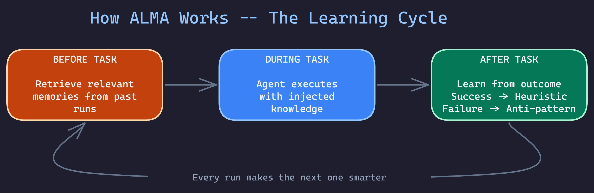
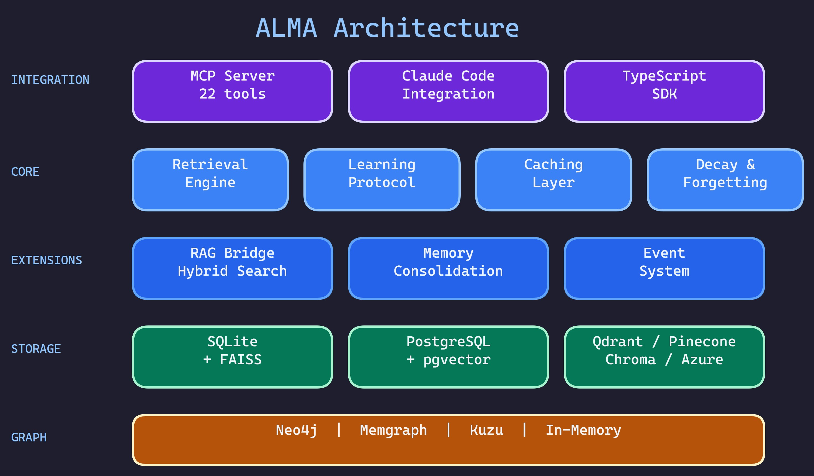

# ALMA - Agent Learning Memory Architecture

<div style="text-align: center; margin: 2rem 0;">
  <h2 style="font-size: 1.5rem; color: #666;">Your AI forgets everything. ALMA fixes that.</h2>
  <p><strong>One memory layer. Every AI. Never start from zero.</strong></p>
  <p><code>pip install alma-memory</code> — 5 minutes to persistent memory. Free forever on SQLite.</p>
</div>

<div class="grid cards" markdown>

-   :material-brain:{ .lg .middle } __Learn from Outcomes__

    ---

    Agents remember what worked and what didn't. Success becomes heuristics, failures become anti-patterns.

-   :material-share-variant:{ .lg .middle } __Multi-Agent Sharing__

    ---

    Hierarchical knowledge sharing with `inherit_from` and `share_with` scopes.

-   :material-shield-check:{ .lg .middle } __Veritas Trust Layer__

    ---

    Built-in trust scoring and verified retrieval. Agents build trust profiles. Contradictions caught before agents act on bad data.

-   :material-database:{ .lg .middle } __7 Storage Backends__

    ---

    SQLite, PostgreSQL, Qdrant, Pinecone, Chroma, Azure Cosmos DB. Your data, your infrastructure.

</div>

## Why ALMA?

ALMA isn't just another memory framework. Here's what sets it apart:

| Feature | ALMA | Mem0 | LangChain Memory |
|---------|------|------|------------------|
| **Trust / Verification** | **Veritas (built-in)** | No | No |
| **Memory Scoping** | `can_learn` / `cannot_learn` | Basic isolation | None |
| **Anti-Pattern Learning** | Yes | No | No |
| **Multi-Agent Sharing** | Yes | No | No |
| **Memory Consolidation** | LLM-powered | Basic | None |
| **Event System** | Webhooks + callbacks | No | No |
| **MCP Integration** | Native | No | No |
| **TypeScript SDK** | Full-featured | No | No |
| **Vector DB Backends** | 6 options | Limited | Limited |

[See full Mem0 comparison](comparison/mem0-vs-alma.md){ .md-button }
[See full LangChain comparison](comparison/langchain-memory-vs-alma.md){ .md-button }

## How It Works



Every time your agent runs, ALMA retrieves what worked before and learns from new outcomes. No manual prompt engineering. No copy-pasting from past conversations. The memory compounds automatically.

---

## Quick Start

=== "Python"

    ```bash
    pip install alma-memory
    ```

    ```python
    from alma import ALMA

    # Initialize
    alma = ALMA.from_config(".alma/config.yaml")

    # Before task: Get relevant memories
    memories = alma.retrieve(
        task="Test the login form validation",
        agent="qa_tester",
        top_k=5
    )

    # Inject into your prompt
    prompt = f"""
    ## Your Task
    Test the login form validation

    ## Knowledge from Past Runs
    {memories.to_prompt()}
    """

    # After task: Learn from outcome
    alma.learn(
        agent="qa_tester",
        task="Test login form",
        outcome="success",
        strategy_used="Tested empty fields, invalid email, valid submission",
    )
    ```

=== "TypeScript"

    ```bash
    npm install @rbkunnela/alma-memory
    ```

    ```typescript
    import { ALMA } from '@rbkunnela/alma-memory';

    // Create client
    const alma = new ALMA({
      baseUrl: 'http://localhost:8765',
      projectId: 'my-project'
    });

    // Retrieve memories
    const memories = await alma.retrieve({
      query: 'authentication flow',
      agent: 'dev-agent',
      topK: 5
    });

    // Learn from outcomes
    await alma.learn({
      agent: 'dev-agent',
      task: 'Implement OAuth',
      outcome: 'success',
      strategyUsed: 'Used passport.js middleware'
    });
    ```

=== "MCP (Claude Code)"

    ```json
    // .mcp.json
    {
      "mcpServers": {
        "alma-memory": {
          "command": "python",
          "args": ["-m", "alma.mcp", "--config", ".alma/config.yaml"]
        }
      }
    }
    ```

    22 MCP tools available: `alma_retrieve`, `alma_learn`, `alma_checkpoint`, and more.

## Five Memory Types


| Type | What It Stores | Example |
|------|----------------|---------|
| **Heuristic** | Learned strategies | "For forms with >5 fields, test validation incrementally" |
| **Outcome** | Task results | "Login test succeeded using JWT token strategy" |
| **Preference** | User constraints | "User prefers verbose test output" |
| **Domain Knowledge** | Accumulated facts | "Login uses OAuth 2.0 with 24h token expiry" |
| **Anti-pattern** | What NOT to do | "Don't use sleep() for async waits - causes flaky tests" |

## Storage Backends

Deploy anywhere with your preferred database:

| Backend | Use Case | Vector Search |
|---------|----------|---------------|
| **SQLite + FAISS** | Local development | Yes |
| **PostgreSQL + pgvector** | Production | Yes (HNSW) |
| **Qdrant** | Managed vector DB | Yes (HNSW) |
| **Pinecone** | Serverless | Yes |
| **Chroma** | Lightweight local | Yes |
| **Azure Cosmos DB** | Enterprise | Yes (DiskANN) |

## v0.8.0 — RAG Integration Layer

The latest release adds:

- **RAG Bridge** — Accept chunks from any RAG framework and enhance with memory signals
- **Hybrid Search** — Vector + keyword with Reciprocal Rank Fusion
- **Feedback Loop** — Track and auto-tune retrieval weights
- **IR Metrics** — MRR, NDCG, Recall, Precision, MAP
- **Cross-Encoder Reranking** — Pluggable reranking pipeline
- **Memory Consolidation** — LLM-powered deduplication across memory types

[View Changelog](about/changelog.md){ .md-button .md-button--primary }

## Architecture



---

## Get Started

<div class="grid cards" markdown>

-   :material-download:{ .lg .middle } __Installation__

    ---

    Install ALMA with pip or npm and configure your first project.

    [:octicons-arrow-right-24: Installation Guide](getting-started/installation.md)

-   :material-rocket-launch:{ .lg .middle } __Quick Start__

    ---

    Build your first memory-powered agent in 5 minutes.

    [:octicons-arrow-right-24: Quick Start](getting-started/quickstart.md)

-   :material-cog:{ .lg .middle } __Configuration__

    ---

    Configure storage backends, agents, and scopes.

    [:octicons-arrow-right-24: Configuration](getting-started/configuration.md)

-   :fontawesome-brands-github:{ .lg .middle } __GitHub__

    ---

    Star the repo, report issues, contribute.

    [:octicons-arrow-right-24: GitHub](https://github.com/RBKunnela/ALMA-memory)

</div>

---

<div style="text-align: center; margin-top: 3rem;">
  <p><strong>Built for AI agents that get better with every task.</strong></p>
  <p>
    <a href="https://pypi.org/project/alma-memory/">PyPI</a> ·
    <a href="https://www.npmjs.com/package/@rbkunnela/alma-memory">npm</a> ·
    <a href="https://github.com/RBKunnela/ALMA-memory">GitHub</a> ·
    <a href="https://github.com/RBKunnela/ALMA-memory/issues">Issues</a>
  </p>
</div>
